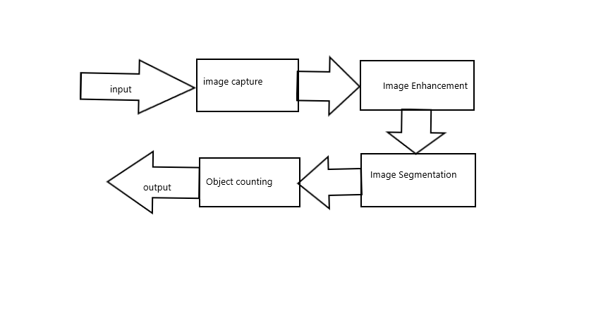
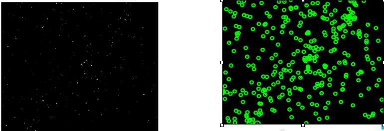
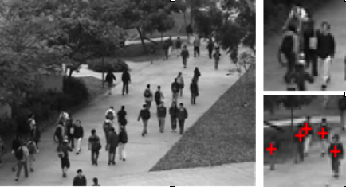

# countingobjects

Estimate accurate count of object in the image by developing a program which detects the objects in an image. The program should automatically detect the desired object and count the number of objects in that image by detecting the edges of an image. 

In here,we have tried to detect exact objects on the image by detecting edges and shapes of the image 
Automatic counting is objective, reliable and reproducible, cells, RBCs, fish, eggs.

